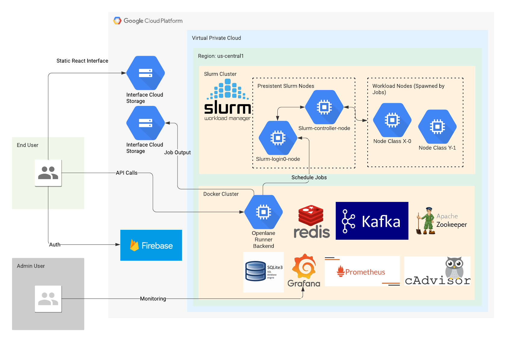

# Openlane-Cloud

## Running / Development & How to Use
### Prerequisites ###

You will need the following things properly installed on your backend virtual machine.
* GCP Account
* Slurm Cluster
* Singularity in /apps shared volume
* [Git](http://git-scm.com/)
* [Node.js](http://nodejs.org/) - Version v8.9.0 (with NPM)
* Docker
### Cloning into this repo ###
1.  ```shell script
    git clone https://github.com/KhaledSoliman/openlane-cloud-backend-typescript
    ```
### Singularity, Storage Buckets, and Openlane Container ###

1. In the Cloud Console, activate Cloud Shell.
2. In Cloud Shell, set environment variables:
    ```shell script
    export PROJECT_ID="$(gcloud config get-value core/project)"
    export CLUSTER_ZONE="us-central1-a"
    export SINGULARITY_REPO="${PROJECT_ID}-singularity"
    export SINGULARITY_VERSION=3.7.3
    export JOBOUTPUT_BUCKET="${PROJECT_ID}-singularity-job-out" 
    ```   
3. In Cloud Shell, log in to the login node of your Slurm cluster:
    ```shell script
    export CLUSTER_LOGIN_NODE=$(gcloud compute instances list --zones $CLUSTER_ZONE --filter="name~.*login." --format="value(name)" | head -n1)
    gcloud compute ssh ${CLUSTER_LOGIN_NODE} --zone $CLUSTER_ZONE
    ```
4. Update installed packages and install the necessary development tools (it will take some time so be patient):
    ```shell script
    sudo yum update -y && \
         sudo yum groupinstall -y 'Development Tools' && \
         sudo yum install -y \
         openssl-devel \
         libuuid-devel \
         libseccomp-devel \
         wget \
         squashfs-tools \
         cryptsetup
    ```
5. Install the Go programming language:
    ```shell script
    export GOLANG_VERSION=1.16.5
    export OS=linux ARCH=amd64
    wget https://dl.google.com/go/go$GOLANG_VERSION.$OS-$ARCH.tar.gz
    sudo tar -C /usr/local -xzvf go$GOLANG_VERSION.$OS-$ARCH.tar.gz
    rm go$GOLANG_VERSION.$OS-$ARCH.tar.gz
    
    echo 'export GOPATH=${HOME}/go' >> ~/.bashrc
    echo 'export PATH=/usr/local/go/bin:${PATH}:${GOPATH}/bin' >> ~/.bashrc
    source ~/.bashrc
    ```
 6. Download a Singularity release:
    ```shell script
    export SINGULARITY_VERSION=3.7.3
    
    wget https://github.com/sylabs/singularity/releases/download/v${SINGULARITY_VERSION}/singularity-${SINGULARITY_VERSION}.tar.gz && \
    tar -xzf singularity-${SINGULARITY_VERSION}.tar.gz && \
    cd singularity
    ```
7. Build and install Singularity in the /apps directory:
    ```shell script
    ./mconfig --prefix=/apps/singularity/${SINGULARITY_VERSION} && \
        make -C ./builddir && \
        sudo make -C ./builddir install
    ```
   By default, Singularity assumes that its configuration files are in the /etc directory. The --prefix flag in the preceding command alters the build so that Singularity looks for those files in the /apps/singularity/RELEASE_NUMBER directory. The /apps directory is available on all of the Slurm compute nodes.
8. Create a Singularity modulefile:
    ```shell script
    sudo mkdir /apps/modulefiles/singularity
    
    sudo bash -c "cat > /apps/modulefiles/singularity/${SINGULARITY_VERSION}" <<SINGULARITY_MODULEFILE
    #%Module1.0#####################################################################
    ##
    ## modules singularity/${SINGULARITY_VERSION}.
    ##
    ## modulefiles/singularity/${SINGULARITY_VERSION}.
    ##
    proc ModulesHelp { } {
            global version modroot
            puts stderr "singularity/${SINGULARITY_VERSION} - sets the environment for Singularity ${SINGULARITY_VERSION}"
    }
    module-whatis   "Sets the environment for using Singularity ${VERSION}"
    # for Tcl script use only
    set     topdir          /apps/singularity/${SINGULARITY_VERSION}
    set     version         ${SINGULARITY_VERSION}
    set     sys             linux86
    prepend-path    PATH            \$topdir/bin
    SINGULARITY_MODULEFILE
    ```
9. Verify the Singularity installation:
    ```shell script
    module load singularity/${SINGULARITY_VERSION}
    singularity
    ```
   The output is similar to the following:
   ```shell script
    Usage:
      singularity [global options...] <command>
    Available Commands:
      build       Build a Singularity image
      cache       Manage the local cache
      capability  Manage Linux capabilities for users and groups
      config      Manage various singularity configuration (root user only)
      delete      Deletes requested image from the library
      exec        Run a command within a container
      inspect     Show metadata for an image
      instance    Manage containers running as services
      key         Manage OpenPGP keys
      oci         Manage OCI containers
      plugin      Manage Singularity plugins
      pull        Pull an image from a URI
      push        Upload image to the provided URI
      remote      Manage singularity remote endpoints
      run         Run the user-defined default command within a container
      run-help    Show the user-defined help for an image
      search      Search a Container Library for images
      shell       Run a shell within a container
      sif         siftool is a program for Singularity Image Format (SIF) file manipulation
      sign        Attach a cryptographic signature to an image
      test        Run the user-defined tests within a container
      verify      Verify cryptographic signatures attached to an image
      version     Show the version for Singularity
    Run 'singularity --help' for more detailed usage information.
    ```
10. Exit the Slurm cluster login node by pressing Control+D.

11. Change directory into openlane-singularity-build:
    ```shell script
       cd ./openlane-singularity-build
    ```
    Use Cloud Build to create the Singularity build step:
    `MAKE SURE YOUR SERVICE AGENT FOR CLOUD BUILD HAS ACCESS TO GOOGLE CLOUD STORAGE`
    ```shell script
    gcloud builds submit \
      --config=singularitybuilder.yaml \
      --substitutions=_SINGULARITY_VERSION=${SINGULARITY_VERSION}
    ```
12. Create a Cloud Storage bucket for the container image:
 
    ```shell script
    gsutil mb gs://${SINGULARITY_REPO}
    ```
13. Build the container:
    ```shell script
    gcloud builds submit --config=containerbuilder.yaml --substitutions=_SINGULARITY_VERSION=${SINGULARITY_VERSION} --timeout 45m
    ```
14. Verify the container build:

    ```shell script
    gsutil ls gs://${SINGULARITY_REPO}
    ```
    The output is similar to the following:
    ```shell script
    gs://SINGULARITY_REPO/openlane.sif
    ```
15. Allow read access to the container so that the Slurm job can pull the container image:
    ```shell script
    gsutil acl ch -g All:R gs://${SINGULARITY_REPO}/openlane.sif
    ```

### Backend ###
After using the openlane-singularity-build to build the openlane singularity container now its time to build the backend and run it.

1. In Cloud Shell, log in to the login node of your Slurm cluster:
    ```shell script
    export CLUSTER_LOGIN_NODE=$(gcloud compute instances list --zones $CLUSTER_ZONE --filter="name~.*login." --format="value(name)" | head -n1)
    gcloud compute ssh ${CLUSTER_LOGIN_NODE} --zone $CLUSTER_ZONE
    ```
2.  Clone Repo
    ```shell script
    git clone https://github.com/KhaledSoliman/openlane-cloud-backend-typescript
    ```
3.  Change directory into repo
    ```shell script
    cd ./openlane-cloud-backend-typescript
    ```
4.  [Install docker on centos](https://docs.docker.com/engine/install/centos/)
5.  Verify docker is running
    ```shell script
    docker
    ```
    Output should be similar to following:
    ```shell script
    Usage:  docker [OPTIONS] COMMAND
    
    A self-sufficient runtime for containers
    
    Options:
          --config string      Location of client config files (default "/home/khaledsoli111_gmail_com/.docker")
      -c, --context string     Name of the context to use to connect to the daemon (overrides DOCKER_HOST env var and default context set with "docker context use")
      -D, --debug              Enable debug mode
      -H, --host list          Daemon socket(s) to connect to
      -l, --log-level string   Set the logging level ("debug"|"info"|"warn"|"error"|"fatal") (default "info")
          --tls                Use TLS; implied by --tlsverify
          --tlscacert string   Trust certs signed only by this CA (default "/home/khaledsoli111_gmail_com/.docker/ca.pem")
          --tlscert string     Path to TLS certificate file (default "/home/khaledsoli111_gmail_com/.docker/cert.pem")
          --tlskey string      Path to TLS key file (default "/home/khaledsoli111_gmail_com/.docker/key.pem")
          --tlsverify          Use TLS and verify the remote
      -v, --version            Print version information and quit
    
    Management Commands:
      app*        Docker App (Docker Inc., v0.9.1-beta3)
      builder     Manage builds
      buildx*     Build with BuildKit (Docker Inc., v0.5.1-docker)
      config      Manage Docker configs
      container   Manage containers
      context     Manage contexts
      image       Manage images
      manifest    Manage Docker image manifests and manifest lists
      network     Manage networks
      node        Manage Swarm nodes
      plugin      Manage plugins
      scan*       Docker Scan (Docker Inc., v0.8.0)
      secret      Manage Docker secrets
      service     Manage services
      stack       Manage Docker stacks
      swarm       Manage Swarm
      system      Manage Docker
      trust       Manage trust on Docker images
      volume      Manage volumes
    
    Commands:
      attach      Attach local standard input, output, and error streams to a running container
      build       Build an image from a Dockerfile
      commit      Create a new image from a container's changes
      cp          Copy files/folders between a container and the local filesystem
      create      Create a new container
      diff        Inspect changes to files or directories on a container's filesystem
      events      Get real time events from the server
      exec        Run a command in a running container
      export      Export a container's filesystem as a tar archive
      history     Show the history of an image
      images      List images
      import      Import the contents from a tarball to create a filesystem image
      info        Display system-wide information
      inspect     Return low-level information on Docker objects
      kill        Kill one or more running containers
      load        Load an image from a tar archive or STDIN
      login       Log in to a Docker registry
      logout      Log out from a Docker registry
      logs        Fetch the logs of a container
      pause       Pause all processes within one or more containers
      port        List port mappings or a specific mapping for the container
      ps          List containers
      pull        Pull an image or a repository from a registry
      push        Push an image or a repository to a registry
      rename      Rename a container
      restart     Restart one or more containers
      rm          Remove one or more containers
      rmi         Remove one or more images
      run         Run a command in a new container
      save        Save one or more images to a tar archive (streamed to STDOUT by default)
      search      Search the Docker Hub for images
      start       Start one or more stopped containers
      stats       Display a live stream of container(s) resource usage statistics
      stop        Stop one or more running containers
      tag         Create a tag TARGET_IMAGE that refers to SOURCE_IMAGE
      top         Display the running processes of a container
      unpause     Unpause all processes within one or more containers
      update      Update configuration of one or more containers
      version     Show the Docker version information
      wait        Block until one or more containers stop, then print their exit codes
    
    Run 'docker COMMAND --help' for more information on a command.
    
    To get more help with docker, check out our guides at https://docs.docker.com/go/guides/
    ```
6. [Install docker compose](https://docs.docker.com/compose/install/)
7. Verify docker compose is installed
    ```shell script
    docker-compose --version
    ```
   Output should be similar to following:
   ```shell script
   docker-compose version 1.29.2, build 1110ad01
   ```
8. [Install nodejs](https://nodejs.org/en/download/package-manager/)
9. Verify npm is installed
    ```shell script
    npm --version
    ```
    Output should be similar to following:
    ```shell script
    3.10.10
    ```
10. Make .env file with all the needed variables example:
    ```shell script
    cat > ./.env <<ENV_FILE
    GOOGLE_APPLICATION_CREDENTIALS="service_account.json"
    env="development"
    PORT=3000
    MAILER_PASS="test"
    JOB_CONCURRENCY=10
    ENV_FILE
    ```
11. Get your service_account file from firebase console and place in root directory
12. Run docker-compose:
    ```shell script
    sudo docker-compose up -d
    ```
13. Install npm dependencies
    ```shell script
    npm install sqlite3
    npm install
    ```
13. Build backend
    ```shell script
    npm run build
    ```
14. Run backend:
    ```shell script
    pm2 start ./build/src/server.js
    ```
    or
    ```shell script
    npm run start
    ```
    * Wait for a minute so that all microservices are up and running. 
    * When the backend is fully booted, you should see a log saying:
    `BOOT :: <> <> <> <> <> <> <> <> <> <> Listening on 0.0.0.0:3030 <> <> <> <> <> <> <> <> <> <>`

## Build

`npm run build`

Uses Gulp [Gulp](https://gulpjs.com/) for TypeScript build

#### FOLDER STRUCTURE

```
config
└───prod
│   prod_config
└───test
│   test_config
└───uat
│   uat_config
deployment
locales
│   english-us
logger
│   winston-logger-setup  
src
└───boot
│   └───initializers
│         initializer-1
│         initializer-2
│         ...
│   boot-file
└───controllers
│     controller-1
│     controller-2
│     ...
└───middlewares
│     middleware-1
│     middleware-2
│     ...
└───models
│     model-1
│     model-2
│     ...
└───routes
│     route-1
│     route-2
│     ...
└───services
│     service-1
│     service-2
│     ...
└───utils
│     util-1
│     util-2
│     ...
└───tests
│     test-1
│     test-2
│     ...
```

## Backend Design

### Architecture
#### Diagram

#### Components
- Prometheus
- Grafana
- Cadvisor
- Mongodb
- Redis
- Nginx
- Kafka
- Zookeeper

### Databases ###
#### Sqlite ####
#### Redis ####
I used Redis as the in memory database to store & process pending orders
### Data Flow ###

### Containers Integrated ###

#### Grafana ####
Running on localhost:3000. Used for monitoring

#### Prometheus ####
Running on localhost:9090. Used for monitoring

#### CAdvisor ####
Running on localhost:8080. Used for containers resources monitoring

#### Redis ####
Running on localhost:6379. Used as in-memory database

#### Kafka ####
Running on localhost:9092. Used for microservices communication

#### Zookeeper ####
Running on localhost:2181. Used along with Kafka

### Assumptions & Limitations ###

## Limitations

1. While the backend was designed with a microservice architecture, all the services use one listening endpoint
2. The database is sqlite and local, not scalable for large number of users

## Credits
* Khaled Soliman
* Under supervision of:
    * Dr. Mohamed Shalan
    * Mohamed Kassem
* Documentation inspired by this [google documentation](https://cloud.google.com/architecture/deploying-containerized-workloads-slurm-cluster-compute-engine#installling_singularity_container_platform)
